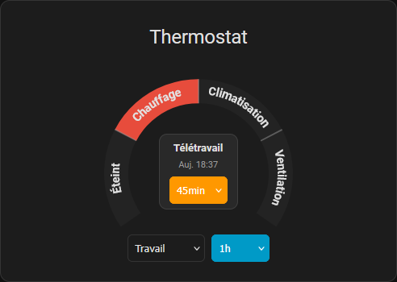

# HomeShift Card

[](https://github.com/hacs/integration)

A clean, compact Lovelace card for Home Assistant to control the **HomeShift** integration from a single visual component.



---

## Overview

HomeShift Card gives you full control over your HomeShift-managed thermostat and daily schedule in one place. It combines an interactive circular arc selector with a set of dropdowns, all designed to stay out of the way while remaining quick to use.

---

## Features

### Circular thermostat selector

The main element of the card is a 270° arc split into color-coded sections — one per thermostat mode. Tap a section to activate it instantly.

| Section     | Color | Mode           |
| ----------- | ----- | -------------- |
| Off         | Gray  | Thermostat off |
| Heating     | Red   | Heating        |
| Cooling     | Blue  | Cooling        |
| Ventilation | Beige | Ventilation    |

### Day mode

A dropdown at the bottom of the card lets you switch the daily profile (e.g. Home, Work, Remote, Away) without leaving the dashboard.

### Override duration

Set a temporary override for the thermostat mode. Choose a preset duration (15 min to 12 h) and the thermostat will hold that mode until the duration expires. The dropdown highlights in the primary color when an override is active.

### Early switch

Advance the next scheduled mode change by a preset amount (15 min to 4 h). Useful when you arrive home earlier than planned. The dropdown highlights in the accent color when active.

### Manual cover control

The scheduled opening and closing times of the daily covers are shown beside the dial. When the HomeShift integration exposes its `button.homeshift_open_covers` / `button.homeshift_close_covers` entities (created when daily covers are configured), each time becomes a button: tap it, or focus it and press Enter, to open or close the covers right away. The row shows "Sending…" while Home Assistant handles the request, and a failure is reported in the usual Home Assistant notification toast. No confirmation is asked: the action is reversible with the other button. When the button entities are missing or unavailable the times stay plain labels.

If the legacy `cover_entity` option is set, it takes priority over the buttons: the rows then call `cover.open_cover` / `cover.close_cover` on that entity, as in previous versions.

### Next mode display

The center of the arc shows the name of the next scheduled mode and its scheduled time. The time refreshes automatically every 30 seconds and displays as a relative duration (e.g. "in 1h30") or an absolute time (Today / Tomorrow + HH:MM).

---

## Requirements

This card requires the [HomeShift integration](https://github.com/Gamso/homeshift) to be installed and configured. The card reads directly from the entities exposed by the integration.

---

## Installation

### HACS (recommended)

<a href="https://my.home-assistant.io/redirect/hacs_repository/?owner=Gamso&repository=homeshift_card&category=plugin"></a>

### Manual

1. Download `homershift-card.js` from the [latest release](https://github.com/Gamso/homeshift_card/releases/latest)
2. Copy it to `config/www/homeshift_card/homershift-card.js`
3. Add the resource in **Settings → Dashboards → Resources**:
   ```
   /local/homeshift_card/homershift-card.js
   ```

---

## Adding the card

1. Open your Home Assistant dashboard
2. Click **Edit Dashboard**
3. Click **Add Card**
4. Search for **HomeShift Card**
5. Configure the entities in the dialog (see below)
6. Save

---

## Configuration

```yaml
type: custom:homershift-card
name: Thermostat
show_title: true

day_mode_entity: select.homeshift_day_mode
thermostat_mode_entity: select.homeshift_thermostat_mode
override_duration_entity: number.homeshift_override_duration
early_switch_entity: number.homeshift_early_switch
next_mode_entity: sensor.homeshift_next_mode
next_mode_at_entity: sensor.homeshift_next_mode_at
```

### Options

| Option                     | Type    | Default                              | Description                     |
| -------------------------- | ------- | ------------------------------------ | ------------------------------- |
| `name`                     | string  | `"Thermostat"`                       | Card title                      |
| `show_title`               | boolean | `true`                               | Show or hide the title          |
| `day_mode_entity`          | string  | `select.homeshift_day_mode`          | Day mode select entity          |
| `thermostat_mode_entity`   | string  | `select.homeshift_thermostat_mode`   | Thermostat mode select entity   |
| `override_duration_entity` | string  | `number.homeshift_override_duration` | Override duration number entity |
| `early_switch_entity`      | string  | `number.homeshift_early_switch`      | Early switch number entity      |
| `next_mode_entity`         | string  | `sensor.homeshift_next_mode`         | Next scheduled mode sensor      |
| `next_mode_at_entity`      | string  | `sensor.homeshift_next_mode_at`      | Next scheduled time sensor      |
| `open_covers_entity`       | string  | `button.homeshift_open_covers`       | Button pressed by the "open now" row  |
| `close_covers_entity`      | string  | `button.homeshift_close_covers`      | Button pressed by the "close now" row |
| `cover_entity`             | string  | _(none)_                             | Legacy: cover opened/closed by the rows; overrides the two buttons when set |

---

## License

MIT
